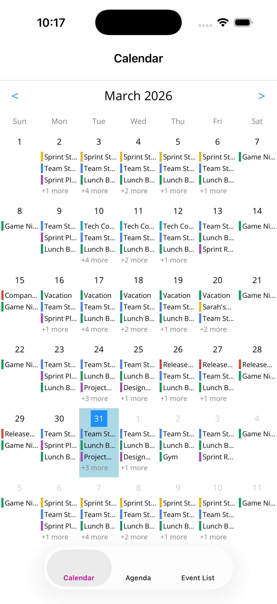
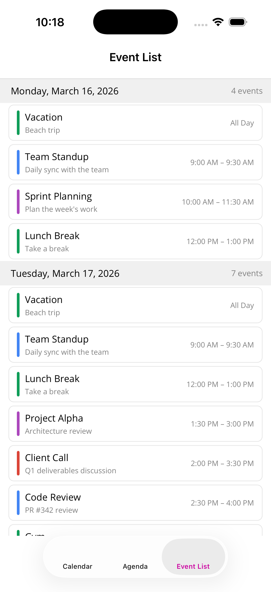

# Shiny.Maui.Scheduler

A .NET MAUI scheduling and calendar component library providing three views: a monthly calendar, an agenda timeline, and a vertically scrolling event list. All views are AOT-safe, fully programmatic (no XAML required), and share a single `ISchedulerEventProvider` interface for data.

## Screenshots

| Calendar | Agenda | Event List |
|:--------:|:------:|:----------:|
|  |  |  |

**NuGet**: `Shiny.Maui.Scheduler`
**Namespace**: `Shiny.Maui.Scheduler`
**Targets**: net10.0-android, net10.0-ios, net10.0-maccatalyst, net10.0-windows

## Setup

### 1. Install

```bash
dotnet add package Shiny.Maui.Scheduler
```

### 2. Configure in MauiProgram.cs

```csharp
var builder = MauiApp.CreateBuilder();
builder
    .UseMauiApp<App>()
    .UseShinyScheduler();
```

The `ISchedulerEventProvider` is not registered in DI — you pass any implementation directly to the view via the `Provider` bindable property.

### 3. Implement ISchedulerEventProvider

```csharp
public class MyEventProvider : ISchedulerEventProvider
{
    public async Task<IReadOnlyList<SchedulerEvent>> GetEvents(DateTimeOffset start, DateTimeOffset end)
    {
        // Return events in the given date range
        return await myService.GetEventsAsync(start, end);
    }

    public void OnEventSelected(SchedulerEvent selectedEvent)
    {
        // Handle event tap
    }

    public bool CanCalendarSelect(DateOnly selectedDate) => true;
    public void OnCalendarDateSelected(DateOnly selectedDate) { }
    public void OnAgendaTimeSelected(DateTimeOffset selectedTime) { }
    public bool CanSelectAgendaTime(DateTimeOffset selectedTime) => true;
}
```

---

## SchedulerEvent Model

```csharp
public class SchedulerEvent
{
    public string Identifier { get; set; }   // Default: new Guid
    public string Title { get; set; }
    public string? Description { get; set; }
    public Color? Color { get; set; }
    public bool IsAllDay { get; set; }
    public DateTimeOffset Start { get; set; }
    public DateTimeOffset End { get; set; }
}
```

---

## Views

### SchedulerCalendarView

A monthly calendar grid with swipe navigation and event dots/summaries per day cell.

```xml
<scheduler:SchedulerCalendarView
    Provider="{Binding Provider}"
    SelectedDate="{Binding SelectedDate}"
    DisplayMonth="{Binding DisplayMonth}"
    MaxEventsPerCell="3"
    FirstDayOfWeek="Sunday"
    CalendarCellColor="White"
    CalendarCellSelectedColor="LightBlue"
    CurrentDayColor="DodgerBlue" />
```

| Property | Type | Default | Description |
|----------|------|---------|-------------|
| Provider | ISchedulerEventProvider? | null | Event data source |
| SelectedDate | DateOnly | Today | Two-way bound selected date |
| DisplayMonth | DateOnly | Today | Two-way bound display month |
| MinDate | DateOnly? | null | Earliest navigable date |
| MaxDate | DateOnly? | null | Latest navigable date |
| ShowCalendarCellEventCountOnly | bool | false | Show count instead of event items |
| EventItemTemplate | DataTemplate? | null | Custom template for event items in cells |
| OverflowItemTemplate | DataTemplate? | null | Custom template for "+N more" overflow |
| LoaderTemplate | DataTemplate? | null | Custom loading indicator |
| MaxEventsPerCell | int | 3 | Max events shown per cell before overflow |
| CalendarCellColor | Color | White | Background color of day cells |
| CalendarCellSelectedColor | Color | LightBlue | Background color of selected day |
| CurrentDayColor | Color | DodgerBlue | Accent color for today |
| FirstDayOfWeek | DayOfWeek | Sunday | First day of the week |
| AllowPan | bool | true | Enable swipe navigation between months |
| AllowZoom | bool | false | Enable pinch-to-zoom on calendar grid |

**Features:**
- Month navigation arrows and swipe left/right
- Tap a day cell to select it
- Events grouped by date with overflow indicator
- All-day events sort to top within each cell
- MinDate/MaxDate bounds enforcement

---

### SchedulerAgendaView

A day/multi-day timeline with hourly time slots, event positioning with overlap detection, and a current time marker.

```xml
<scheduler:SchedulerAgendaView
    Provider="{Binding Provider}"
    SelectedDate="{Binding SelectedDate}"
    DaysToShow="{Binding DaysToShow}"
    ShowCarouselDatePicker="True"
    ShowCurrentTimeMarker="True"
    ShowAdditionalTimezones="{Binding ShowAdditionalTimezones}"
    CurrentTimeMarkerColor="Red"
    DefaultEventColor="CornflowerBlue"
    TimeSlotHeight="60"
    Use24HourTime="False" />
```

| Property | Type | Default | Description |
|----------|------|---------|-------------|
| Provider | ISchedulerEventProvider? | null | Event data source |
| SelectedDate | DateOnly | Today | Two-way bound selected date |
| MinDate | DateOnly? | null | Earliest selectable date |
| MaxDate | DateOnly? | null | Latest selectable date |
| DaysToShow | int | 1 | Number of day columns (1-7) |
| ShowCarouselDatePicker | bool | true | Show horizontal date carousel |
| ShowCurrentTimeMarker | bool | true | Show red line at current time |
| Use24HourTime | bool | true | Use 24-hour format (HH:mm) or 12-hour (h:mm tt) |
| EventItemTemplate | DataTemplate? | null | Custom template for events |
| LoaderTemplate | DataTemplate? | null | Custom loading indicator |
| DayPickerItemTemplate | DataTemplate? | null | Custom template for carousel date picker items |
| CurrentTimeMarkerColor | Color | Red | Color of the time marker line |
| TimezoneColor | Color | Gray | Color of time labels |
| SeparatorColor | Color | Light gray | Color of hourly separator lines |
| DefaultEventColor | Color | CornflowerBlue | Default event background color |
| TimeSlotHeight | double | 60 | Height in pixels per hour slot |
| AllowPan | bool | true | Enable scrolling the timeline |
| AllowZoom | bool | false | Enable pinch-to-zoom (adjusts TimeSlotHeight) |
| ShowAdditionalTimezones | bool | false | Toggle visibility of additional timezone columns |
| AdditionalTimezones | IList\<TimeZoneInfo\> | empty | Additional timezones to display alongside local time |

**Features:**
- 1-day or multi-day column layout
- Sticky per-day date headers above each day column
- In multi-day view, time labels appear once on the left (not repeated per day)
- Horizontal date carousel picker (Apple Calendar-style by default)
- Custom day picker items via `DayPickerItemTemplate` using `DatePickerItemContext`
- Overlapping events displayed side-by-side in columns
- All-day events shown in a top section
- Current time marker with exact time display, updates every minute
- 24-hour or 12-hour (AM/PM) time format via `Use24HourTime`
- Multiple timezone columns with sticky timezone abbreviation headers
- Timezone headers only show local tz label when additional timezones are visible
- Tap time slots to create events
- MinDate/MaxDate bounds enforcement

**Multiple Timezones:**
```csharp
// Add timezones in code-behind or view setup
AgendaView.AdditionalTimezones.Add(TimeZoneInfo.FindSystemTimeZoneById("America/New_York"));
AgendaView.ShowAdditionalTimezones = true; // or bind to a ViewModel property
```

---

### SchedulerCalendarListView

A vertically scrolling event list grouped by day with infinite scroll in both directions. Uses `CollectionView` for virtualization.

```xml
<scheduler:SchedulerCalendarListView
    Provider="{Binding Provider}"
    SelectedDate="{Binding SelectedDate}"
    DefaultEventColor="CornflowerBlue"
    DaysPerPage="30" />
```

| Property | Type | Default | Description |
|----------|------|---------|-------------|
| Provider | ISchedulerEventProvider? | null | Event data source |
| SelectedDate | DateOnly | Today | Two-way bound; centers the list on this date |
| MinDate | DateOnly? | null | Earliest loadable date (stops backward scroll) |
| MaxDate | DateOnly? | null | Latest loadable date (stops forward scroll) |
| EventItemTemplate | DataTemplate? | null | Custom template for event items |
| DayHeaderTemplate | DataTemplate? | null | Custom template for day group headers |
| LoaderTemplate | DataTemplate? | null | Custom loading indicator |
| DaysPerPage | int | 30 | Number of days loaded per incremental fetch |
| DefaultEventColor | Color | CornflowerBlue | Default color for event indicators |
| DayHeaderBackgroundColor | Color | Transparent | Background color of day headers |
| DayHeaderTextColor | Color | Black | Text color of day headers |
| AllowPan | bool | true | Enable scroll gestures |
| AllowZoom | bool | false | Enable pinch-to-zoom |

**Features:**
- Grouped by day with headers ("Monday, March 30, 2026")
- Today indicator dot and event count on day headers
- Empty days are skipped (only days with events are shown)
- Multi-day events appear in each day they span
- All-day events sort to top, then timed events by start time
- Event items show start-end time range or "All Day"
- Infinite scroll forward (RemainingItemsThreshold) and backward (Scrolled event)
- MinDate/MaxDate bounds enforcement stops infinite scroll at boundaries
- Initial load centers on SelectedDate
- Tap an event to trigger `Provider.OnEventSelected()`

**CalendarListDayGroup** (used for custom `DayHeaderTemplate` bindings):
```csharp
public class CalendarListDayGroup : List<SchedulerEvent>
{
    public DateOnly Date { get; }
    public string DateDisplay { get; }       // "dddd, MMMM d, yyyy"
    public bool IsToday { get; }
    public string EventCountDisplay { get; } // "3 events"
}
```

---

## Custom Templates

All views support custom `DataTemplate` properties. Templates must use AOT-safe lambda bindings (no string-based bindings):

```csharp
var template = new DataTemplate(() =>
{
    var label = new Label();
    label.SetBinding(Label.TextProperty, static (SchedulerEvent e) => e.Title);
    return label;
});
```

### Built-in Default Templates

The `DefaultTemplates` static class provides these reusable templates:

| Method | Used By | Description |
|--------|---------|-------------|
| `CreateEventItemTemplate()` | Calendar | Color bar + title label |
| `CreateOverflowTemplate()` | Calendar | "+N more" overflow label |
| `CreateLoaderTemplate()` | All views | ActivityIndicator + "Loading..." |
| `CreateCalendarListDayHeaderTemplate()` | CalendarList | Accent bar + today dot + bold date + event count |
| `CreateCalendarListEventItemTemplate()` | CalendarList | Border card with color bar, title, description, start-end time range |
| `CreateAppleCalendarDayPickerTemplate()` | Agenda (default) | Apple Calendar-style day picker with circle selection |

### DatePickerItemContext

Used for custom `DayPickerItemTemplate` bindings in `SchedulerAgendaView`:

```csharp
public class DatePickerItemContext
{
    public DateOnly Date { get; set; }
    public string DayNumber { get; set; }   // "30"
    public string DayName { get; set; }     // "MON"
    public string MonthName { get; set; }   // "MAR"
    public bool IsSelected { get; set; }
    public bool IsToday { get; set; }
}
```

---

## Sample App

The `samples/SampleApp` project demonstrates all three views with a tabbed interface:

- **Calendar** tab: `SchedulerCalendarView` with month navigation
- **Agenda** tab: `SchedulerAgendaView` with 1-day/3-day toggle
- **Event List** tab: `SchedulerCalendarListView` with infinite scroll

Run the sample:

```bash
dotnet build Shiny.Maui.Scheduler.slnx
dotnet build -t:Run -f net10.0-maccatalyst samples/SampleApp/SampleApp.csproj
```

---

## Project Structure

```
src/Shiny.Maui.Scheduler/
    ISchedulerEventProvider.cs          # Provider interface
    SchedulerCalendarView.cs            # Monthly calendar view
    SchedulerAgendaView.cs              # Day/multi-day agenda timeline
    SchedulerCalendarListView.cs        # Grouped event list with infinite scroll
    Models/
        SchedulerEvent.cs               # Event data model
        CalendarOverflowContext.cs       # Overflow context for calendar cells
        CalendarListDayGroup.cs         # Day group for calendar list
        DatePickerItemContext.cs        # Context for custom day picker templates
    Defaults/
        DefaultTemplates.cs             # Built-in DataTemplate factories
    Extensions/
        MauiAppBuilderExtensions.cs     # UseShinyScheduler() extension
    Internal/
        AgendaTimelinePanel.cs          # Timeline column for agenda view
        AllDayEventsSection.cs          # All-day events horizontal strip
        CalendarDayCell.cs              # Individual day cell in calendar grid
        CurrentTimeIndicator.cs         # Red line time marker
        DateCarouselPicker.cs           # Horizontal date picker carousel

samples/SampleApp/
    Pages/                              # ContentPages for each view
    ViewModels/                         # INotifyPropertyChanged ViewModels
    Services/
        SampleSchedulerProvider.cs      # Sample event data generator
```

## License

See [LICENSE](LICENSE) for details.
